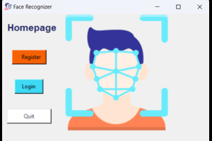
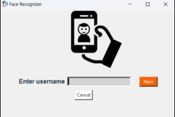
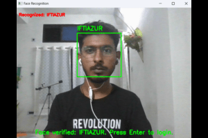
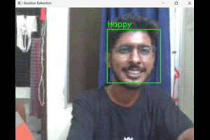
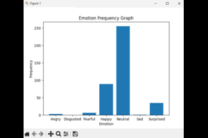

# Facial Recognition-Based Login and Emotion Tracking

   

## Introduction

This project focuses on integrating facial recognition-based login with real-time emotion tracking. The system enhances security by using biometric facial recognition for user authentication while simultaneously analyzing the user's emotions. The insights gathered can be applied to areas such as sentiment analysis, user experience enhancement, and more. This technology aims to improve security, convenience, and the development of emotionally intelligent systems across various domains.

## Table of Contents

1. [Introduction](#introduction)
2. [Facial Recognition](#facial-recognition)
3. [Emotion Tracking](#emotion-tracking)
4. [Advantages](#advantages)
   - [Advantages of Facial Recognition](#advantages-of-facial-recognition)
   - [Advantages of Emotion Tracking](#advantages-of-emotion-tracking)
5. [Working of the Systems](#working-of-the-systems)
   - [Working of the Face Recognition Model](#working-of-the-face-recognition-model)
   - [Working of Emotion Tracking](#working-of-emotion-tracking)
6. [Features](#features)

7. [Requirements](#requirements)

8. [Components](#components)

9. [Overview of the Project](#overview-of-the-project)
   - [User Registration](#user-registration)
   - [Creation of Classifier](#creation-of-classifier)
   - [Login using Facial Recognition](#login-using-facial-recognition)
   - [Dashboard](#dashboard)
   - [Emotion Tracking and Representation](#emotion-tracking-and-representation)
10. [Use Cases](#use-cases)
11. [Challenges and Limitations](#challenges-and-limitations)
12. [Conclusion](#conclusion)

## Facial Recognition

Facial recognition is a biometric technology that identifies and verifies individuals by analyzing unique facial features. It allows for secure access and authentication, significantly reducing the risk of unauthorized access.

## Emotion Tracking

Emotion tracking involves identifying and analyzing human emotions through various data sources, such as facial expressions, voice tone, or physiological signals. This process helps in understanding the emotional state of individuals, providing valuable feedback for enhancing user experiences.

## Advantages

### Advantages of Facial Recognition

- **Increased Security**: High level of security, making it difficult to replicate or fake someone's face.
- **Accessibility**: Users no longer need to remember complex passwords.
- **Improved Accuracy**: More accurate identification compared to traditional methods.

### Advantages of Emotion Tracking

- **Enhanced User Experience**: Personalized content or services based on emotional responses.
- **Real-time Feedback**: Immediate feedback during presentations, training, and customer interactions.
- **Mental Wellbeing**: Helps monitor and assess various aspects of mental health.

## Working of the Systems

### Working of the Face Recognition Model

1. **Detection**: Capturing and identifying faces.
2. **Analysis**: Analyzing facial features.
3. **Recognition**: Matching faces against a database for authentication.

### Working of Emotion Tracking
v
1. **Data Collection**: Gathering data from sources like facial expressions or voice tone.
2. **Processing and Analysis**: Using algorithms to analyze the data.
3. **Classification**: Determining the emotional state based on the analysis.

## Features

- User registration with facial data capture
- Face recognition-based login system
- Real-time emotion detection
- User session tracking
- Emotion frequency visualization

## Requirements

- Python 3.9 or greater
- OpenCV
- TensorFlow
- Tkinter
- Matplotlib
- NumPy

## Components

1. **Main Application (app-gui.py)**
   - Implements the graphical user interface using tkinter
   - Manages different pages for registration, login, and user sessions
   - Integrates face recognition and emotion detection functionalities

2. **Classifier Creation (create_classifier.py)**
   - Trains a Local Binary Patterns Histograms (LBPH) face recognizer
   - Creates classifier XML files for registered users

3. **Dataset Creation (create_dataset.py)**
   - Captures facial images for new user registration
   - Implements a progress meter for image capture

4. **Face Detection and Recognition (Detector.py)**
   - Performs real-time face detection and recognition
   - Verifies user identity for login

5. **Emotion Detection (emotion_detection.py)**
   - Utilizes a pre-trained convolutional neural network for emotion classification
   - Detects and displays emotions in real-time video feed

6. **Emotion Detection Testing (testerFile.py)**
   - Provides a testing interface for the emotion detection system
   - Allows real-time emotion detection and frequency visualization

7. **Emotion Detection Model Training (training.py)**
   - Defines and trains a convolutional neural network for emotion detection
   - Uses image data generators for efficient training
   - Saves the trained model weights

## Overview of the Project

### User Registration

- Users register by entering their name automatically creating a directory for storing their face images.
- Detected faces are marked and saved as images to create a comprehensive dataset for training.

   

### Creation of Classifier

- The system loads previously captured face images from a specified directory.
- These images are associated with their respective users.
- An LBPH (Local Binary Pattern Histogram) classifier is initialized, trained with labeled data, and saved for future use.

### Login using Facial Recognition

- The intended user is selected, and their face is captured.
- The grayscale region of interest (ROI) is extracted and passed to the LBPH face recognizer for comparison against the saved classifier.

   
   

### Dashboard

- The dashboard displays the user's username, login date and time, and session duration.
- Features include an "Emotion" button for tracking user emotions and a "Log Out" button.
- A user profile picture can be included for personalization.

   

### Emotion Tracking and Representation

- The system opens the camera feed to show real-time emotion data.
- A bar graph represents the frequencies of individual emotions.

   
   

## Use Cases

- **Medical Industry**: For observing subjects' emotional states.
- **Corporate Industry**: Monitoring employee mental health.
- **Marketing Industry**: Understanding reactions to advertisements.
- **Entertainment Industry**: Gathering feedback on content.

## Challenges and Limitations

- **Potential for Bias and Inaccuracy**: Inherent biases in facial recognition technology.
- **Security Concerns**: Risks of being hacked or bypassed.
- **Privacy Concerns**: Issues related to the collection, storage, and potential misuse of facial data.

## Conclusion

- This project explored facial recognition-based login and emotion tracking technologies.
- While facial recognition offers convenience and security, it also raises ethical and privacy concerns.
- Emotion tracking provides valuable insights for market research and healthcare.
- Responsible use and privacy considerations are essential for both technologies.
- Balancing innovation with ethics is key to maximizing their societal benefits.
"""
